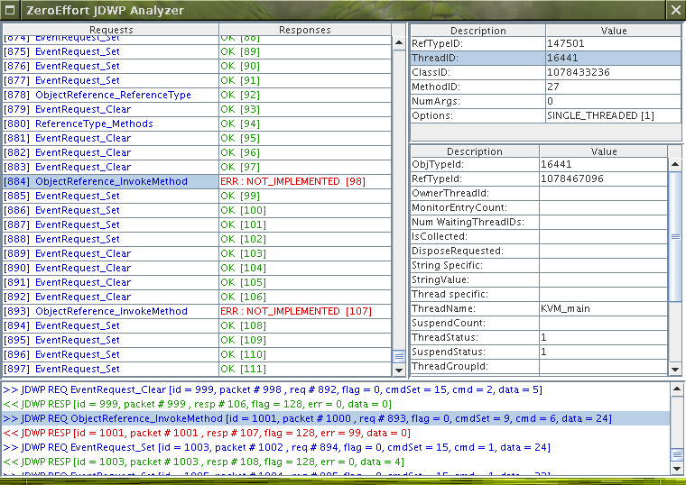

ZeroEffort JDWP Analyzer
========================

This is a fork of [ZeroEffort](https://github.com/kherink/jdwp-analyzer) which had gone unmaintained (and did not even build anymore).

ZeroEffort is a JDWP (Java Debug Wire Protocol) analysis tool to help debug a JVM or Debugger. It can be used to help with the following tasks.

- Track down problems with the debuggee VM.
- Track down problems with the debugger.
- Monitor the amount of traffic during debug session.

It is compliant with Java 1.5 JDWP





# Architecture

ZeroEffort uses a MitM (Man-In-The-Middle) approach by placing itself between the debugger and the debuggee.

# How to build

Install maven.

Mac OS X
```
brew install maven
```

Linux:
```
sudo apt install maven
```

Then build the `jar`:
```
mvn package
```

# Manual

```
java -jar target/jdwp-analyzer-1.0.jar inport outaddress indelay outdelay [log_dir]

inport = the port to which debugger connects

outaddress = the address (as host:port) on which the debuggee VM is waiting for debug connection. Only the port is required for localhost VMs.

indelay = amount of time in MS to wait before passing a packet to the debuggee VM

outdelay = amount of time in MS to wait before passing a packet to the debugger

log_dir = OPTIONAL log directory path for writing debugging session JDWP packets
```


## To replay a debugging session from log:

```
java -jar JDWPAnalyzer.jar log_dir
log_dir = log directory path for replaying a debugging session
```

# Tutorial

## Start the VM to be debugged

```
$ java -agentlib:jdwp=transport=dt_socket,server=y,suspend=y -cp target/jdwp-analyzer-1.0.jar Example
```

You should see the following output.

```
Listening for transport dt_socket at address: 49416
```

Notice how you can chose betwen `suspend=y` and `suspend=n`. This sets if the VM start in interrupted or running mode.

Also notice the port number that the JDWP agent is listening on (in this example, `49416`.

## Start ZeroEffort 

Open a second terminal.

```
$ java -jar target/jdwp-analyzer-1.0.jar 5555 localhost:49416 0 0
```

Notice how we used the port number provided when we started the debuggee `49416` and we forward this traffic to port 5555.


## Start a debugger

Open a third terminal. You can use any debugger but for the purpose of this tutorial, we are going to use the Java Debugger `jdb`.

```
$ jdb -attach 5555
```

Now we can issue commands, and we see the JDWP traffic in the Swing GUI.

```
stop at Example:7
run
```

The VM stops and we can issue more commands.

```
step
```
